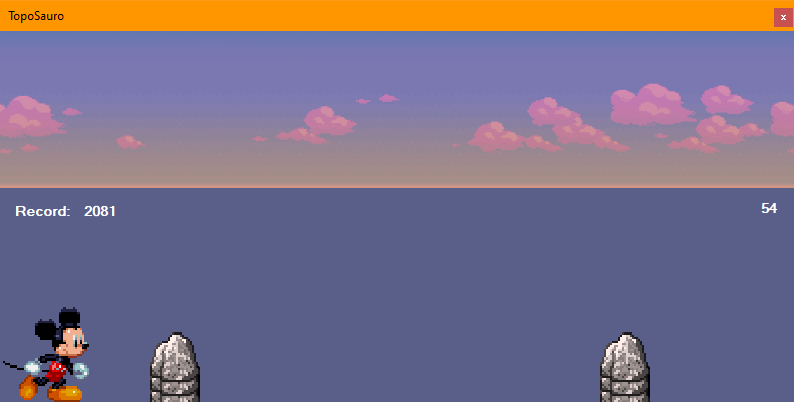

# TopoSauro
Programma creato alla scuola superiore tramite l'uso del modello "Form" di Visual Studio
Una parodia del gioco "Chrome Dino" con l'implementazione di "Topolino" e altri personaggi parodia
  

  

